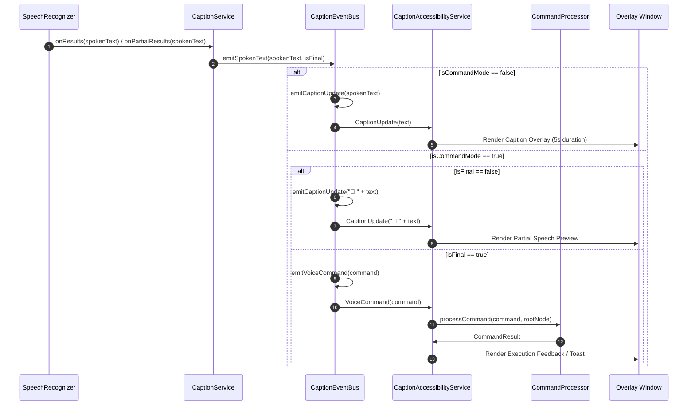

# System Architecture & Component Design

This document details the high-level architecture, reactive event pipeline, concurrency models, and component interactions of **Blink Board**.

---

## 🏛️ High-Level System Architecture

Blink Board follows a modular, event-driven Android architecture designed for high performance, low memory footprint, and low-latency response times.

```mermaid
flowchart TD
    subgraph UI Layer ["UI & Presentation Layer"]
        MA[MainActivity]
        MVM[MainViewModel]
        MS[MainScreen Composables]
    end

    subgraph Event Layer ["Reactive Event Layer (In-Memory)"]
        CEB[CaptionEventBus]
        EF[_events: SharedFlow]
        CM[_isCommandMode: StateFlow]
        LS[_isListening: StateFlow]
    end

    subgraph Service Layer ["Background & System Services"]
        CS[CaptionService\n(Foreground Service)]
        SR[SpeechRecognizer]
        AR[AudioRecord\n(Mic / MediaProjection)]
        
        CAS[CaptionAccessibilityService\n(Accessibility Service)]
        CP[CommandProcessor\n(NLP Engine)]
        WM[WindowManager Overlay]
    end

    subgraph System OS ["Android Operating System"]
        OS_ACC[Accessibility Node Hierarchy]
        OS_TEL[TelephonyManager / Call State]
        OS_PM[PackageManager / App Launching]
    end

    %% UI Connections
    MA <--> MVM
    MVM <--> MS
    MVM <--> CEB

    %% CaptionService Connections
    CS --> SR
    CS --> AR
    CS <--> OS_TEL
    SR -->|Speech Results| CEB

    %% Event Bus Routing
    CEB --> EF
    CEB --> CM
    CEB --> LS
    EF -->|Events| CAS

    %% Accessibility Service Connections
    CAS --> WM
    CAS --> CP
    CP <-->|Traverse / Action| OS_ACC
    CP <-->|Launch App| OS_PM
```

---

## 🧩 Core Architectural Components

Blink Board consists of four primary subsystem layers:

### 1. Presentation & State Layer (`MainActivity`, `MainViewModel`, `MainScreen`)
- **Responsibility**: Provides user interface controls, handles runtime permission flows, displays live status, and allows operating mode toggling.
- **Pattern**: Unidirectional Data Flow (UDF) using Jetpack Compose and `MainViewModel` backing `MainUiState`.
- **Adapter**: Subscribes directly to `CaptionEventBus.isCommandMode` and `CaptionEventBus.isListening` state flows to maintain synchronized UI state without binding directly to background services.

### 2. Audio Capture & Speech Engine (`CaptionService`)
- **Responsibility**: Runs as an Android `ForegroundService` with `microphone` and `mediaProjection` types.
- **Functions**:
  - Captures raw speech via `SpeechRecognizer` (on-device or system fallback).
  - Handles raw PCM 16-bit audio streaming via `AudioRecord`.
  - Automatically switches audio capture sources between standard `MIC` mode and `IN_CALL` loopback capture via `AudioPlaybackCaptureConfiguration`.
  - Emits recognized text to `CaptionEventBus`.

### 3. Reactive Event Stream (`CaptionEventBus`)
- **Responsibility**: Serves as the central, thread-safe, decoupled event and state pipeline.
- **Design Pattern**: Singleton In-Memory Event Bus utilizing Kotlin `SharedFlow` and `StateFlow`.
- **Advantages**: Eliminates heavy Android BroadcastReceivers, avoids inter-process IPC overhead, and guarantees memory-safe subscriber lifecycle management.

### 4. Accessibility & Execution Engine (`CaptionAccessibilityService` & `CommandProcessor`)
- **Responsibility**: System Accessibility Service bound via `BIND_ACCESSIBILITY_SERVICE`.
- **Functions**:
  - Manages a floating translucent `TextView` window overlay (`WindowManager.LayoutParams.TYPE_ACCESSIBILITY_OVERLAY`).
  - Listens to `CaptionEventBus.events` for updates.
  - In **Caption Mode**: Renders real-time speech transcription on the floating overlay with automated auto-dismiss timers.
  - In **Command Mode**: Passes recognized voice strings to `CommandProcessor` to search active accessibility node trees (`AccessibilityNodeInfo`) and execute actions.

---

## 🔄 Reactive Event Pipeline (`CaptionEventBus`)

The `CaptionEventBus` object manages application-wide communication:

```kotlin
object CaptionEventBus {
    private val _events = MutableSharedFlow<CaptionEvent>(extraBufferCapacity = 64)
    val events: SharedFlow<CaptionEvent> = _events.asSharedFlow()

    private val _isCommandMode = MutableStateFlow(false)
    val isCommandMode: StateFlow<Boolean> = _isCommandMode.asStateFlow()

    private val _isListening = MutableStateFlow(false)
    val isListening: StateFlow<Boolean> = _isListening.asStateFlow()
}
```

### Event Types (`CaptionEvent`)

```kotlin
sealed interface CaptionEvent {
    data class CaptionUpdate(val text: String) : CaptionEvent
    data class VoiceCommand(val command: String) : CaptionEvent
}
```

### Data Flow Logic for Speech Recognition
When speech recognition returns transcriptions:



---

## ⚡ Concurrency & Thread Safety Strategy

1. **Main Thread Non-Blocking Policy**:
   - UI updates and overlay window modifications execute strictly on `Dispatchers.Main`.
   - Node traversal, string matching, and Levenshtein distance dynamic programming calculations in `CommandProcessor` execute on `Dispatchers.Default`.
   - Raw audio PCM buffer processing runs on dedicated background execution threads (`kotlin.concurrent.thread`).

2. **Coroutine Scopes**:
   - `CaptionAccessibilityService` uses `CoroutineScope(SupervisorJob() + Dispatchers.Main)`.
   - Scopes are explicitly cancelled in `onDestroy()` to guarantee zero coroutine or view window leaks.

3. **Atomic State & Flags**:
   - `CaptionService` uses `AtomicBoolean` (`isCapturing`) to safely synchronize audio capture loop state across threads.

---

Next: Proceed to [**Speech & Audio Engine**](speech-and-audio-engine.md) for details on speech recognition and call capture.
